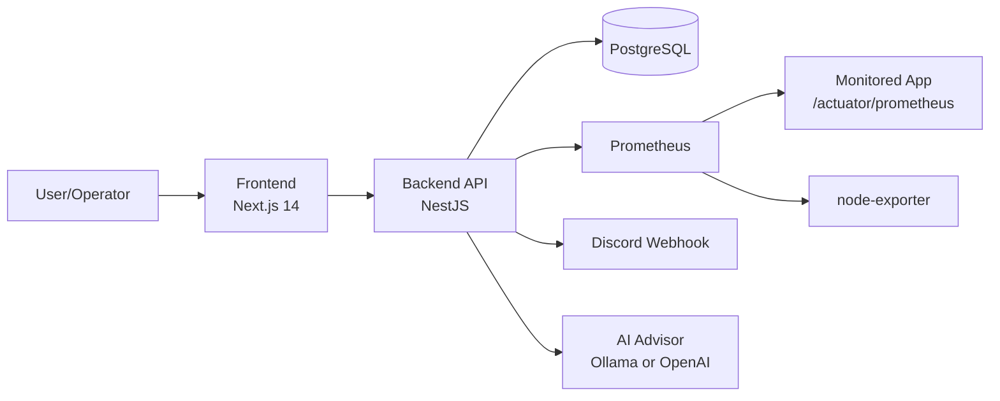
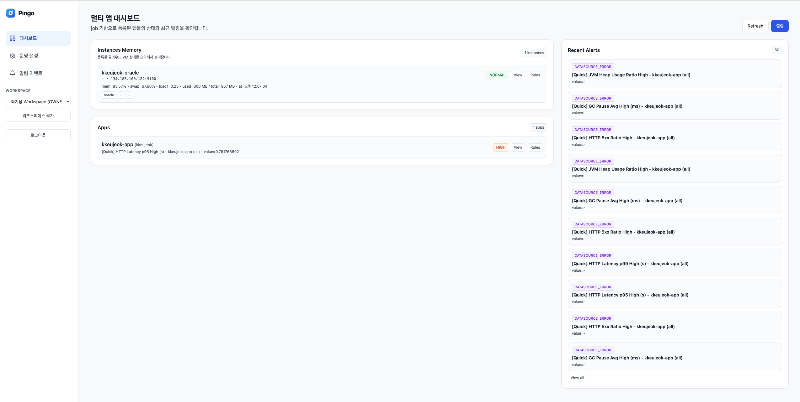
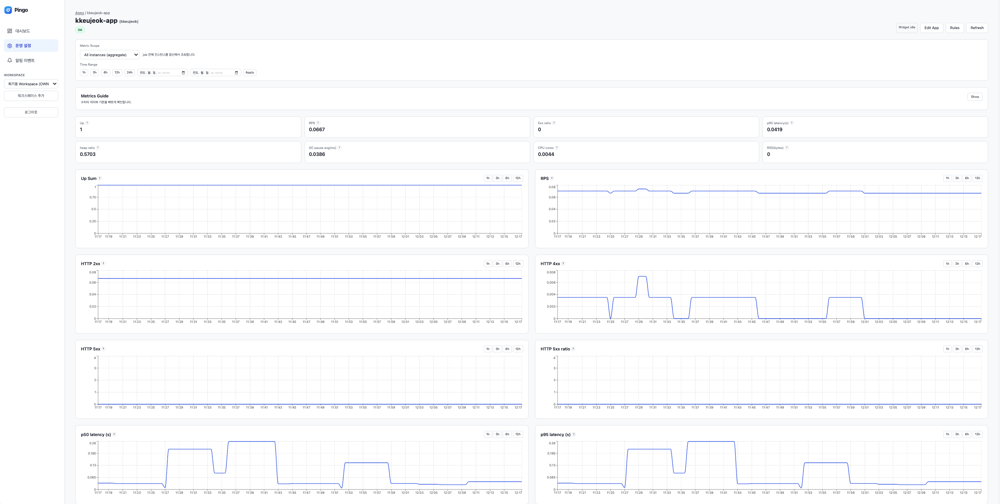
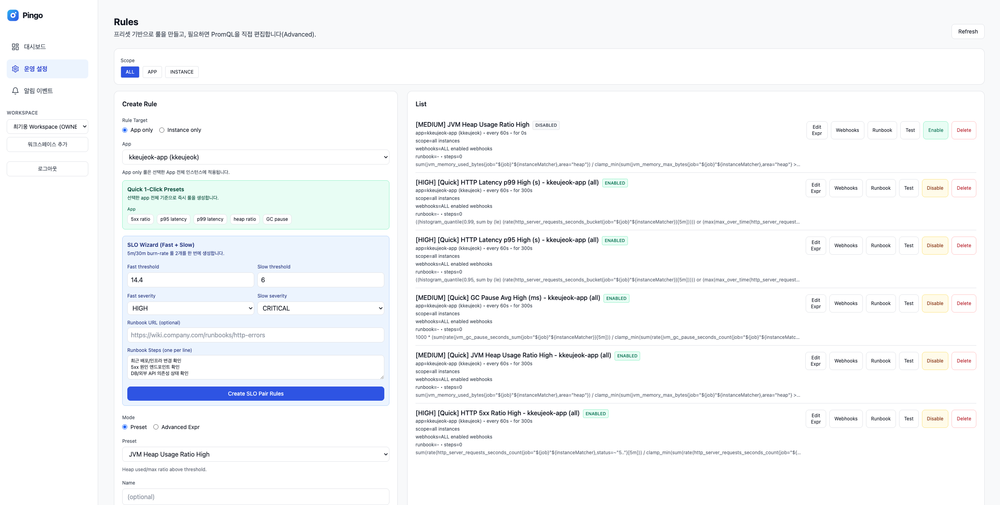
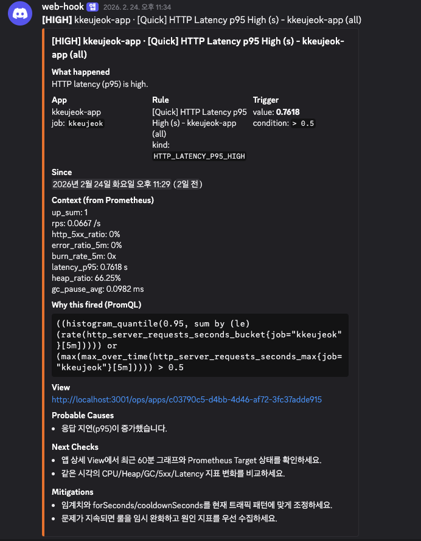

# pingo


Prometheus 기반 운영 모니터링/알림 서비스로, 인프라 사양과 무관하게 적용할 수 있으며 운영 장애를 조기에 탐지하고 대응 의사결정을 빠르게 만들기 위한 프로젝트입니다.

- Backend: NestJS + TypeORM
- Frontend: Next.js 14
- Alert: Discord Webhook
- AI Advisor (optional): Ollama(Local) or OpenAI

## 목차

- [왜 Pingo인가](#왜-pingo인가)
- [핵심 기능](#핵심-기능)
- [Pingo 강점](#pingo-강점)
- [기술 스택](#기술-스택)
- [프로젝트 구조](#프로젝트-구조)
- [아키텍처](#아키텍처)
- [스크린샷](#스크린샷)
- [빠른 시작 (Docker)](#빠른-시작-docker)
- [로컬 개발](#로컬-개발)
- [주요 환경 변수](#주요-환경-변수)
- [일반 사용 흐름](#일반-사용-흐름)
- [트러블슈팅 팁](#트러블슈팅-팁)
- [인스턴스 메모리 모니터링 (node-exporter)](#인스턴스-메모리-모니터링-node-exporter)
- [선택 사항: 로컬 AI (Ollama)](#선택-사항-로컬-ai-ollama)
- [AI 보조 개발](#ai-보조-개발)
- [라이선스](#라이선스)

## 왜 Pingo인가

`pingo`는 다양한 사양의 환경에서 사용할 수 있도록 설계했습니다. 다만 제작 계기는 `VM.Standard.E2.1.Micro(1GB)` 환경에서 `kafka`, `redis`, `app-dev`, `app-prod(blue/green)`, `prometheus`를 동시에 운영하며 발생한 주기적 OOM/인스턴스 다운 이슈였고, 이를 지표 기반으로 탐지/분석/알림 자동화하기 위해 구현했습니다.

핵심 접근은 단일 원인 단정이 아니라 다음 흐름입니다.

1. 사실 확인: 다운 직전 메모리/Swap/GC 지표 임계치 초과
2. 원인 후보 설정: 컨테이너 과밀, Kafka 로그 세그먼트 증가, JVM Metaspace 증가
3. 조치/검증: 메모리 상한, Heap, 로그 보존 정책, JVM 옵션 튜닝 후 전후 지표 비교
4. 결과 확인: 메모리 피크/Swap 구간 안정화, 동일 패턴 재발 방지

## 핵심 기능

- Prometheus 지표 기반 실시간 모니터링
  - 앱(JVM/HTTP) 및 인스턴스(node-exporter) 메트릭 수집/조회
  - 대시보드/상세 페이지 시각화 및 시계열 드릴다운
- 운영 리소스 등록/관리
  - Clusters, Apps, Instances, Rules, Webhooks UI 제공
  - 앱/인스턴스별 위젯 레이아웃 저장
- Rule 기반 알림 엔진
  - 상태 전이 중심 알림 및 쿨다운 적용
  - 룰 활성/비활성, 스코프(App/Instance), 프리셋/고급식(PromQL) 지원
- Discord Webhook 알림
  - 선택 웹훅 라우팅, runbook 링크 포함 메시지 전송
- 앱 헬스/알림 이벤트 추적
  - 앱 상태(OK/DEGRADED/DOWN/UNKNOWN) 및 이벤트 이력 조회
- AI Advisor (옵션)
  - 원인 후보/대응안 제안
  - AI 실패 시 폴백 분석으로 일관된 응답 유지

## Pingo 강점

- 알림 발생 직후 현재 메트릭/스냅샷 기반으로 **원인 후보 + 대응 액션**을 자동 제안
- **Local LLM(온프레미스)** 중심 구성으로 외부 API 의존 없이 운영 가능
- Runbook 없이도 초기 대응안을 생성하고, 기존 Runbook이 있으면 보완적으로 함께 사용 가능
- AI 응답 실패 시 폴백 분석을 제공해 운영 중단 없이 일관된 가이드 유지

## 기술 스택

- Backend: NestJS, TypeORM, PostgreSQL, Axios
- Frontend: Next.js 14, React, Recharts
- Infra: Docker, Docker Compose, Prometheus
- Notification: Discord Webhook
- AI (optional): Ollama, OpenAI

## 프로젝트 구조

```text
.
├── backend/                          # NestJS API
│   ├── src/
│   │   ├── auth/                     # 인증/워크스페이스
│   │   ├── monitoring/               # 모니터링 수집/분석 API
│   │   ├── ops/                      # 클러스터/앱/인스턴스/룰/웹훅
│   │   ├── database/                 # TypeORM 설정/마이그레이션
│   │   ├── app.module.ts
│   │   └── main.ts
│   ├── scripts/                      # DB 백업/복구 스크립트
│   ├── Dockerfile
│   └── package.json
├── frontend/                         # Next.js 14 대시보드
│   ├── src/
│   │   ├── pages/
│   │   │   ├── dashboard.tsx
│   │   │   ├── ops/                  # 운영 화면(클러스터/앱/인스턴스/룰/알림)
│   │   │   └── auth/                 # 로그인/회원가입/초대수락
│   │   ├── features/
│   │   │   ├── monitoring/           # 모니터링 API/컴포넌트/타입
│   │   │   ├── ops/                  # Ops API 클라이언트
│   │   │   └── auth/                 # Auth API 클라이언트
│   │   ├── layouts/
│   │   ├── styles/
│   │   └── utils/
│   ├── public/
│   ├── Dockerfile
│   └── package.json
├── docs/
│   └── screenshots/                  # README 이미지 자산
├── tools/
│   └── aegisctl.mjs                  # 운영 보조 스크립트
├── docker-compose.yml
├── .env.example
└── README.md
```

## 아키텍처



## 스크린샷

### Dashboard



### Apps Detail



### Rules



### Discord Webhook Message



## 빠른 시작 (Docker)

1. 환경변수 파일 생성

```bash
cp .env.example .env
```

2. `.env` 필수값 입력

- `DB_USERNAME`
- `DB_PASSWORD`
- `DB_NAME`
- `APP_SECRET` (16자 이상 권장)

3. 서비스 실행

```bash
docker compose up -d --build
```

4. 접속

- Frontend: `http://localhost:3001`
- Backend: `http://localhost:3002`

중지:

```bash
docker compose down
```

## 로컬 개발

Backend:

```bash
cd backend
npm install
npm run start:dev
```

Frontend:

```bash
cd frontend
npm install
npm run dev -- -p 3001
```

## 주요 환경 변수

- DB: `DB_HOST`, `DB_PORT`, `DB_USERNAME`, `DB_PASSWORD`, `DB_NAME`
- Alert Engine: `ALERT_ENGINE_ENABLED`, `ALERT_ENGINE_CONCURRENCY`
- Prometheus: `PROMETHEUS_URL`, `PROMETHEUS_TARGET_LABELS`
- Node/VM 모니터링: `PROMETHEUS_NODE_*`, `INSTANCE_MEMORY_WARN_RATIO`, `INSTANCE_MEMORY_CRITICAL_RATIO`
- Discord 링크: `OPS_PUBLIC_URL`
- AI: `AI_PROVIDER`, `OLLAMA_URL`, `OLLAMA_MODEL`, `OPENAI_API_KEY`, `OPENAI_MODEL`

## 일반 사용 흐름

1. `Ops > Clusters`에서 Prometheus 클러스터 등록/테스트
2. `Ops > Apps`에서 모니터링 대상 앱 등록
3. `Ops > Instances`에서 VM 인스턴스(node-exporter target) 등록
4. `Ops > Webhooks`에서 Discord Webhook 등록
5. `Ops > Rules`에서 임계치 룰 및 라우팅 설정
6. 알림 발생 시 Discord + 상세 페이지 링크로 원인 추적

## 트러블슈팅 팁

- 앱이 `DOWN`인데 서버는 살아있으면: 앱 상세의 `Prometheus Target` 패널에서 `lastError`, `lastScrape` 확인
- `DOWN(dns)`: 타겟 DNS/네트워크 이슈 가능성 큼
- `DOWN(scrape timeout)`: 부하로 `/actuator/prometheus` 응답 지연 가능성 큼

## 인스턴스 메모리 모니터링 (node-exporter)

대시보드 상단 `Instance Memory` 카드는 `node-exporter` 메트릭을 사용합니다.

필수 조건:

- Prometheus가 `node_memory_*`, `node_swap_*`, `node_load1`를 수집
- `.env`에서 `PROMETHEUS_NODE_LABELS`를 실제 타겟 라벨에 맞게 설정

예시:

- `PROMETHEUS_NODE_LABELS=job="node-exporter"`
- 또는 `PROMETHEUS_NODE_LABELS=instance="134.185.100.182:9100"`

권장 임계치:

- `INSTANCE_MEMORY_WARN_RATIO=0.85`
- `INSTANCE_MEMORY_CRITICAL_RATIO=0.95`

## 선택 사항: 로컬 AI (Ollama)

1. Ollama 실행

```bash
docker compose --profile ai up -d ollama
```

2. 모델 다운로드

```bash
docker compose exec -T ollama ollama pull qwen2.5:3b
```

3. `.env` 설정

```env
AI_PROVIDER=ollama
OLLAMA_URL=http://ollama:11434
OLLAMA_MODEL=qwen2.5:3b
```

4. backend 재시작

```bash
docker compose up -d --force-recreate backend
```

## AI 보조 개발

이 프로젝트는 개발 과정에서 AI agent(Codex)와 재사용 가능한 skills를 보조 도구로 활용했습니다.

- 사용 목적: 코드 초안/리팩터링, 문서화, 점검 자동화
- 원칙: 최종 설계/검증/의사결정은 사람이 수행
- 안전: 비밀정보(토큰, webhook URL, 내부 민감정보)는 AI 입력에 포함하지 않음

## 라이선스

MIT License. See [LICENSE](./LICENSE).
